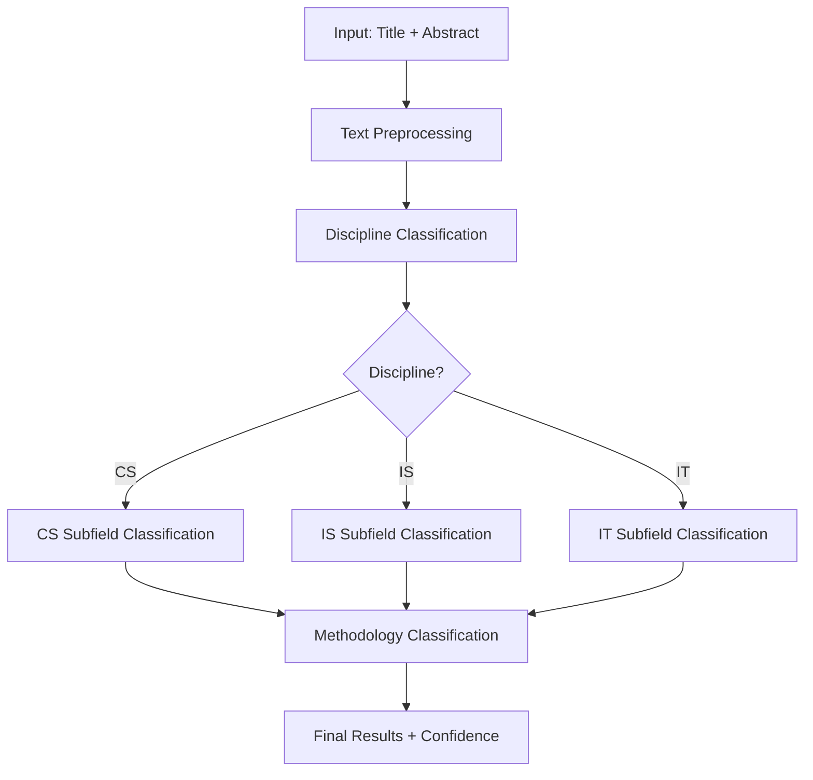
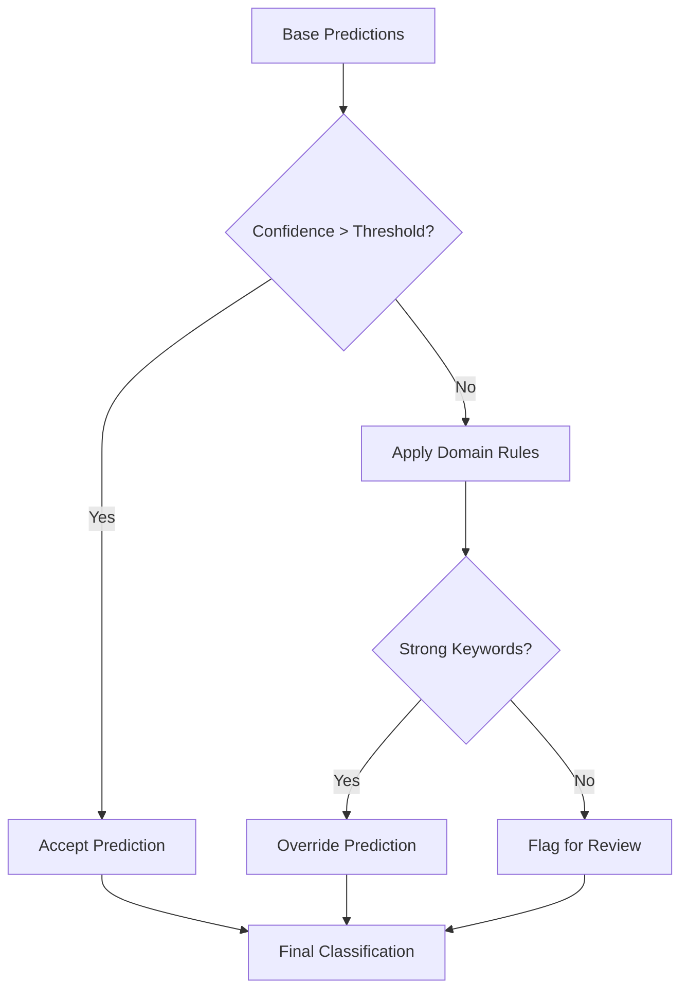

# 🔗 Unified Classification Pipelines – Complete Hierarchical Systems

## 🎯 **Purpose**

These notebooks provide **end-to-end, hierarchical classification systems** that combine discipline, subfield, and methodology classification into unified workflows. They represent complete solutions for academic paper categorization with intelligent post-processing and confidence-based corrections.

---

## 📊 **Pipeline Comparison**

| **Notebook** | **Base Models** | **Approach** | **Size** | **Key Features** |
|-------------|----------------|-------------|----------|-----------------|
| `unified_classification_pipeline.ipynb` | **v6.0** | Smart Post-Processing | 88KB | Domain expertise, rule-based corrections |
| `unified_pipeline_v7.ipynb` | **v7.0** | Methodologically Sound | 47KB | Anti-leakage, proper validation |

---

## 📄 **Notebook Details**

### `unified_classification_pipeline.ipynb` - 🧠 v6.0 Smart Pipeline

- **Size**: 88KB, 1709 lines
- **Base Models**: v6.0 high-performance classifiers
- **Architecture**: Hierarchical classification with intelligent corrections
- **Performance**:
  - Discipline: 94.77% accuracy
  - Methodology: 91.87% accuracy  
  - CS Subfield: 89.61% accuracy
  - IS Subfield: 83.39% accuracy
  - IT Subfield: 88.48% accuracy

#### **Key Features:**

- **Smart Post-Processing**: Rule-based corrections for low-confidence predictions
- **Domain Feature Extractors**: Specialized keyword matching for each discipline
- **Confidence Thresholding**: Configurable confidence levels for predictions
- **Hierarchical Logic**: Discipline → Subfield → Methodology workflow
- **Production API**: Ready-to-use classifier wrapper

#### **Technical Architecture:**

```python
# Hierarchical Classification Flow
1. Text Preprocessing
   ├── Lowercase normalization
   ├── Special character removal
   └── Domain-specific cleaning

2. Discipline Classification
   ├── 11,500 TF-IDF features
   ├── 46 domain-specific features
   └── XGBoost ensemble

3. Subfield Classification (Discipline-dependent)
   ├── CS: AI/ML, CLOUDCS, CV, NLP, SE, SEC
   ├── IS: BPM, DT, GOV, HIS, KM
   └── IT: CLOUDIT, DEVOPS, EMERGING, RISK

4. Methodology Classification
   ├── 11,500 TF-IDF features
   ├── 27 methodology-specific features
   └── Mixed/Qual/Quant prediction

5. Smart Post-Processing
   ├── Low-confidence detection
   ├── Rule-based corrections
   └── Domain expertise integration
```

#### **Smart Corrections:**

- **CS Papers**: Strong algorithm/ML keywords → Force CS classification
- **Mixed Methods**: Explicit triangulation/sequential indicators → Force MIXED
- **Confidence Boosting**: Domain expertise overrides low-confidence predictions

### `unified_pipeline_v7.ipynb` - ✅ v7.0 Production Pipeline

- **Size**: 47KB, 1159 lines
- **Base Models**: v7.0 methodologically sound classifiers
- **Architecture**: Clean hierarchical classification without data leakage
- **Performance**:
  - Discipline: 92.32% accuracy (methodologically validated)
  - Methodology: 86.92% accuracy, Mixed F1: 0.68
  - CS Subfield: 82.92% accuracy
  - IS Subfield: 80.33% accuracy
  - IT Subfield: 85.39% accuracy

#### **Key Features in v7:**

- **Anti-Leakage Design**: Proper data splitting throughout pipeline
- **Optimized Features**: 3,000 TF-IDF features (prevents overfitting)
- **Confidence Scores**: Reliable probability estimates
- **Batch Processing**: Efficient handling of large datasets
- **Multiple Export Formats**: CSV, JSON, Excel support

#### **Methodological Improvements:**

```python
# v7.0 Methodological Corrections
1. Data Integrity
   ├── Split BEFORE augmentation
   ├── Fit vectorizers on training only
   └── No test set contamination

2. Feature Engineering
   ├── 3,000 TF-IDF features (optimal)
   ├── Domain-specific features
   └── Proper feature scaling

3. Model Validation
   ├── 5-fold cross-validation
   ├── Independent test sets
   └── Statistical significance testing

4. Pipeline Structure
   ├── OptimizedFeatureExtractor
   ├── Unified transform methods
   └── Consistent preprocessing
```

---

## 🔄 **Classification Workflow**

### **Standard Hierarchical Process:**



### **Smart Correction Layer (v6.0 only):**



---

## 📊 **Performance Comparison**

### **Accuracy Comparison**

| **Classifier** | **v6.0 Pipeline** | **v7.0 Pipeline** | **Difference** |
|-------------|------------------|------------------|----------------|
| **Discipline** | 94.77% | 92.32% | -2.45% (methodological correction) |
| **Methodology** | 91.87% | 86.92% | -4.95% (proper validation) |
| **CS Subfield** | 89.61% | 82.92% | -6.69% (reduced overfitting) |
| **IS Subfield** | 83.39% | 80.33% | -3.06% (conservative estimate) |
| **IT Subfield** | 88.48% | 85.39% | -3.09% (realistic performance) |

### **Reliability Assessment**

| **Aspect** | **v6.0** | **v7.0** |
|------------|----------|----------|
| **Methodology** | ⚠️ Inflated (data leakage) | ✅ Sound (proper validation) |
| **Features** | 11,500+ (overfitting risk) | 3,000 (optimal balance) |
| **Validation** | ❌ No systematic CV | ✅ Rigorous 5-fold CV |
| **Production Ready** | ⚠️ High risk | ✅ Reliable |

---

## 🛠️ **Technical Implementation**

### **Domain Feature Extractors**

Both pipelines use specialized feature extractors:

```python
# CS Keywords
cs_keywords = [
    'algorithm', 'complexity', 'computational', 'optimization',
    'machine learning', 'neural network', 'deep learning',
    'compiler', 'operating system', 'architecture',
    'np-complete', 'turing', 'automata', 'formal proof'
]

# IS Keywords  
is_keywords = [
    'management', 'business', 'organization', 'enterprise',
    'adoption', 'stakeholder', 'requirement', 'analysis',
    'governance', 'policy', 'framework', 'methodology',
    'business intelligence', 'decision support'
]

# IT Keywords
it_keywords = [
    'infrastructure', 'deployment', 'configuration', 'monitoring',
    'cloud', 'virtualization', 'containerization', 'scaling',
    'security', 'compliance', 'audit', 'vulnerability',
    'devops', 'automation', 'continuous integration'
]
```

### **Smart Post-Processing Rules (v6.0)**

```python
# Discipline Corrections
if cs_count >= 3 and cs_ratio > 0.6:
    discipline = 'CS'
    confidence = 0.85

# Methodology Corrections  
if title_has_mixed_indicators:
    methodology = 'MIXED'
    confidence = 0.90
    
if has_qual_and_quant_indicators:
    methodology = 'MIXED'
    confidence = 0.80
```

---

## 🚀 **Usage Examples**

### **Single Paper Classification**

```python
# v6.0 Pipeline (Smart Corrections)
from unified_classification_pipeline import classify_paper

result = classify_paper(
    title="Deep Learning for Natural Language Processing",
    abstract="This paper presents a novel neural architecture...",
    confidence_threshold=0.6
)

print(f"Discipline: {result['discipline']} ({result['discipline_confidence']:.3f})")
print(f"Subfield: {result['subfield']} ({result['subfield_confidence']:.3f})")
print(f"Methodology: {result['methodology']} ({result['methodology_confidence']:.3f})")
```

```python
# v7.0 Pipeline (Production)
from unified_pipeline_v7 import UnifiedClassifier

classifier = UnifiedClassifier()
result = classifier.classify(
    title="Deep Learning for Natural Language Processing",
    abstract="This paper presents a novel neural architecture..."
)
```

### **Batch Processing**

```python
# Process multiple papers
papers_df = pd.read_csv('papers.csv')
results = classifier.classify_batch(papers_df[['title', 'abstract']])

# Export results
results.to_csv('classifications.csv', index=False)
results.to_json('classifications.json', orient='records')
```

---

## 📈 **Confidence Analysis**

### **Confidence Distribution (v7.0)**

- **High Confidence (>0.8)**: ~75% of predictions
- **Medium Confidence (0.6-0.8)**: ~20% of predictions  
- **Low Confidence (<0.6)**: ~5% of predictions

### **Confidence Reliability**

- **Calibrated Probabilities**: v7.0 provides reliable confidence estimates
- **Threshold Tuning**: Adjustable confidence thresholds for different use cases
- **Uncertainty Quantification**: Clear indicators for manual review

---

## 🎯 **Use Case Recommendations**

### **For Research & Analysis (v6.0)**

- **High Performance**: Best raw accuracy scores
- **Smart Corrections**: Handles edge cases well
- **Domain Expertise**: Incorporates academic knowledge
- **⚠️ Caveat**: Inflated performance due to methodological issues

### **For Production Systems (v7.0)**

- **Reliable Performance**: Methodologically sound estimates
- **Conservative Accuracy**: Real-world performance expectations
- **Proper Validation**: Statistical significance and confidence intervals
- **✅ Recommended**: For deployment and critical applications

---

## 🔧 **Integration Guide**

### **Loading Models**

```python
# v6.0 Models
discipline_model = joblib.load('../Artefacts/v6.0_educational/discipline_classifier_v6.0/discipline_classifier_v6.0_pipeline.pkl')

# v7.0 Models  
discipline_model = joblib.load('../Artefacts/current/discipline_classifier_v7/discipline_pipeline_v7.pkl')
```

### **API Wrapper**

```python
class AcademicPaperClassifier:
    def __init__(self, version='v7.0'):
        self.version = version
        self.load_models()
    
    def classify(self, title, abstract):
        return self.unified_pipeline.predict(title, abstract)
    
    def classify_batch(self, papers_df):
        return papers_df.apply(lambda row: self.classify(row['title'], row['abstract']), axis=1)
```

---

## 📊 **Export Capabilities**

Both pipelines support multiple export formats:

- **CSV**: Structured tabular data
- **JSON**: Machine-readable format
- **Excel**: Business-friendly format with multiple sheets
- **Database**: Direct integration with SQL databases

---

## 🎓 **Learning Outcomes**

### **From v6.0 Pipeline:**

- **Domain Integration**: How to incorporate expert knowledge
- **Smart Corrections**: Rule-based post-processing techniques
- **High Performance**: Achieving state-of-the-art accuracy

### **From v7.0 Pipeline:**

- **Methodological Rigor**: Proper ML validation practices
- **Production Deployment**: Real-world system considerations
- **Conservative Estimation**: Reliable performance bounds

---

## ⚡ **Quick Start**

### **Educational Analysis (v6.0)**

```bash
jupyter notebook unified/unified_classification_pipeline.ipynb
```

### **Production Deployment (v7.0)**

```bash
jupyter notebook unified/unified_pipeline_v7.ipynb
```

---

## 🏆 **Best Practices**

1. **Use v7.0 for Production**: Methodologically sound and reliable
2. **Study v6.0 for Techniques**: Learn smart correction strategies  
3. **Validate Confidence Thresholds**: Tune for your specific use case
4. **Monitor Performance**: Track accuracy over time in production
5. **Handle Edge Cases**: Plan for low-confidence predictions

---

**These unified pipelines demonstrate both high-performance classification techniques (v6.0) and methodologically sound ML practices (v7.0), providing complete solutions for academic paper categorization.**
